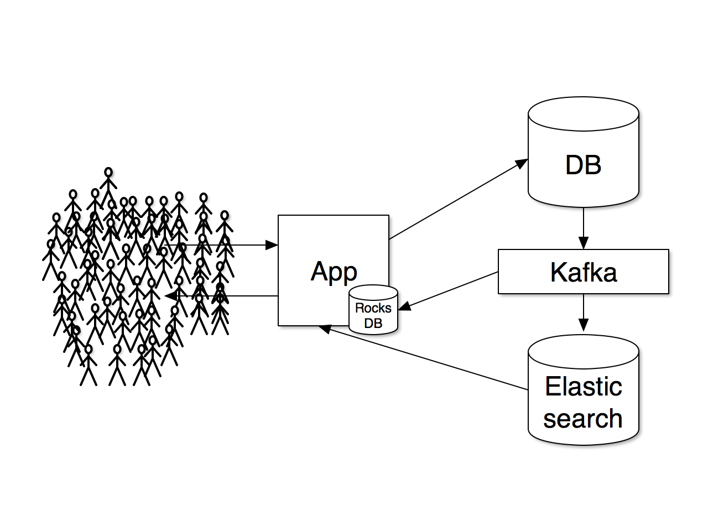

## Overview

Simple example that stores users and tweets in [Postgres](http://www.postgresql.org/), uses [Bottled Water](https://github.com/confluentinc/bottledwater-pg) to stream data changes to [Kafka](http://kafka.apache.org/) topics, and then replicates data into [RocksDB](http://rocksdb.org/) and [Elasticsearch](https://www.elastic.co/products/elasticsearch).



## Run the Things

Run all data stores & services (e.g. Postgres, Bottled Water, Zookeeper, Kafka, Elasticsearch):

```
./docker-run.sh
```

Run REST API service:

```
cd api
sbt run
# choose: [1] com.banno.Main
```

Create users and tweets from Twitter Streaming API:

```
cd api
sbt run
# choose: [2] com.banno.TwitterStreamingMain
```

Note that when creating users and tweets from the Twitter Streaming API, Bottled Water will probably eventually crash. This is [caused by a known bug](https://github.com/confluentinc/bottledwater-pg/issues/32) and will hopefully get fixed.

## Use the Things

```
#create user
curl -XPOST -H 'Content-Type: application/json' localhost:8181/api/users -d '{"username":"foo1", "name":"Foo", "description":"I like foo", "imageUrl":""}'

#update user
curl -XPUT -H 'Content-Type: application/json' localhost:8181/api/users/1 -d '{"id":1, "username":"foo1", "name":"Foo", "description":"I really like foo", "imageUrl":""}'

#get user
curl localhost:8181/api/users/1

#create tweet
curl -XPOST -H 'Content-Type: application/json' localhost:8181/api/tweets -d '{"text":"Scala is great", "userId":1}'

#get tweet
curl localhost:8181/api/tweets/1

#search
curl 'localhost:8181/api/search?q=like'
```

[](https://waffle.io/zcox/data-replication-example)
